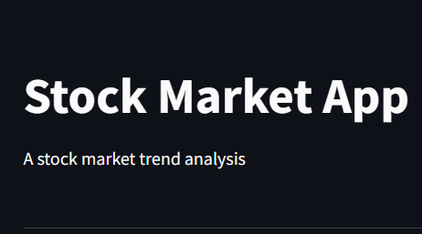

# STOCK MARKET ANALYSER

This project is a stock market market analyser built by using python, Flask, streamlit framework.

## *HOW TO RUN*

1. ### *first clone the project*

    `git clone https://github.com/kart9071/project-stock_market.git`

2. ### *move to the flask_app folder*

    `cd flask_app`

3. ### *run your app.py by using*

    `python app.py`

4. ### *follow the link*

    <http://127.0.0.1:5000> 

5. ### *change the url with adding **/streamlit***

    <http://127.0.0.1:5000/streamlit>

6. ### *it will open a new application on the url localhost:8051*

    <http://localhost:8501/>

